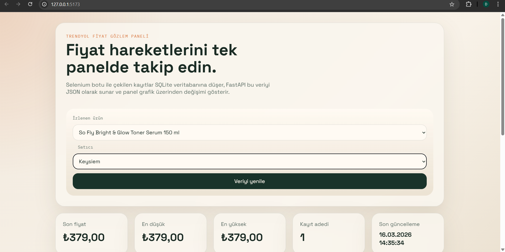

# Trendyol Fiyat Takip

Bu proje, Trendyol uzerindeki urunlerin fiyat gecmisini **satici bazli** olarak toplayip SQLite veritabanina kaydeden, FastAPI ile JSON olarak sunan ve React panelinde grafik olarak gosteren iki katmanli bir yapidir.

## Ekran Goruntusu



## Kisa Demo

Asagidaki goruntu, satici bazli secim ve fiyat panelinin calisma gorunumunu gosterir:


## 1 Dakikada Kurulum

Asagidaki adimlar ile projeyi hizli sekilde ayaga kaldirabilirsin:

```bash
# 1) Backend
cd backend
python -m venv .venv
.venv\Scripts\activate
pip install -r requirements.txt
python database.py
python scraper.py
uvicorn api:app --reload --host 127.0.0.1 --port 8000
```

```bash
# 2) Yeni terminal acip frontend
cd frontend
npm install
npm run dev
```

Panel: `http://127.0.0.1:5173`
API: `http://127.0.0.1:8000/api/urunler`

## Proje Mimarisi

```text
trendyol-fiyat-takip/
├── backend/
│   ├── api.py
│   ├── database.py
│   ├── requirements.txt
│   ├── scheduler.py
│   └── scraper.py
└── frontend/
    ├── public/
    ├── src/
    │   ├── components/
    │   │   └── PriceChart.jsx
    │   ├── services/
    │   │   └── api.js
    │   ├── App.jsx
    │   ├── index.css
    │   └── main.jsx
    ├── index.html
    ├── package.json
    └── vite.config.js
```

## Calisma Akisi

1. `scraper.py`, Trendyol urun sayfasini headless Chrome ile acar.
2. Urun basligi, ana satici ve diger saticilarin fiyatlarini CSS seciciler ile bulur.
3. Kayitlar veritabanina `Urun Adi [Satici Adi]` formatinda yazilir.
4. `database.py`, bu kayitlari urun + satici bazli gruplayarak API'ye hazirlar.
5. `api.py`, sonucu `/api/urunler` uzerinden JSON olarak sunar.
6. React arayuzu urun ve satici secimiyle fiyat degisimini cizgi grafik olarak gosterir.

## Backend Kurulumu

Python 3.10+ onerilir.

```bash
cd backend
python -m venv .venv
.venv\Scripts\activate
pip install -r requirements.txt
```

### 1. Veritabanini hazirla

```bash
python database.py
```

Bu komut `data.db` dosyasini ve `fiyatlar` tablosunu olusturur.

### 2. Scraper icin urun URL'lerini gir

[backend/scraper.py](backend/scraper.py) icindeki `TARGET_PRODUCTS` listesine takip etmek istedigin Trendyol urun linklerini ekle.

Satici bazli takip icin URL'de `merchantId` parametresinin olmasi onerilir:

- Ornek: `https://www.trendyol.com/.../p-123?boutiqueId=61&merchantId=164987`

Not: Trendyol sayfa yapi ve secicileri zamanla degisebilir. Fiyat veya baslik okunamazsa ayni dosya icindeki `TITLE_SELECTORS` ve `PRICE_SELECTORS` listelerini guncelle.

### 3. Tek seferlik veri cekme

```bash
python scraper.py
```

### 4. Zamanlayiciyi calistir

```bash
python scheduler.py
```

Bu dosya scraper'i her gun `09:00` ve `21:00` saatlerinde tetikler.

### 5. API sunucusunu baslat

```bash
uvicorn api:app --reload
```

API varsayilan olarak `http://127.0.0.1:8000` uzerinde calisir.

Kullanilabilir endpointler:

- `GET /api/health`
- `GET /api/urunler`
- `GET /api/urunler?urun_url=<urun-linki>`

## Frontend Kurulumu

Node.js 18+ onerilir.

```bash
cd frontend
npm install
npm run dev
```

Vite gelistirme sunucusu varsayilan olarak `http://127.0.0.1:5173` uzerinde acilir.

Istersen API taban adresini su sekilde degistirebilirsin:

```bash
set VITE_API_BASE_URL=http://127.0.0.1:8000/api
```

## Veri Formati

`/api/urunler` ciktisi su yapiya sahiptir:

```json
{
  "adet": 1,
  "urunler": [
    {
      "urun_adi": "Ornek Urun",
      "urun_url": "https://www.trendyol.com/...",
      "saticilar": {
        "The Purest Solutions": [
          {
            "id": 1,
            "fiyat": 315.53,
            "tarih": "2026-03-16T09:00:00"
          }
        ],
        "vitalecza": [
          {
            "id": 2,
            "fiyat": 385.0,
            "tarih": "2026-03-16T09:00:00"
          }
        ]
      }
    }
  ]
}
```

## Kullanilan Kutuphaneler ve Ne Ise Yaradiklari

### Backend (Python)

- `fastapi`: REST API endpoint'lerini hizli sekilde olusturmak icin kullanilir (`/api/health`, `/api/urunler`).
- `uvicorn[standard]`: FastAPI uygulamasini ASGI sunucusu olarak calistirir.
- `selenium`: Tarayiciyi otomasyonla acip Trendyol sayfasindan veri cekmek icin kullanilir.
- `webdriver-manager`: ChromeDriver surumunu otomatik indirip yonetir.
- `schedule`: Scraper'i belirli saatlerde tetikleyen zamanlayici gorevleri icin kullanilir.
- `sqlite3` (Python stdlib): Harici servis gerekmeden yerel veritabani kayitlari icin kullanilir.
- `re` (Python stdlib, regular expression): Metin ayristirma icin kullanilir.
  - Bu projede `Urun Adi [Satici]` formatini parcalamak ve urun/satici ayristirmasi yapmak icin faydalidir.
- `datetime` (Python stdlib): Kayitlara zaman damgasi eklemek icin kullanilir.
- `contextlib` (Python stdlib): Baglanti/uygulama omru gibi kaynak yonetimlerini temiz yapmak icin kullanilir.
- `pathlib` (Python stdlib): Dosya yollarini platformdan bagimsiz sekilde yonetir.
- `typing` (Python stdlib): Fonksiyon tip ipuclari ile kod okunabilirligini artirir.

### Frontend (JavaScript)

- `react`: Bilesen tabanli kullanici arayuzunu olusturur.
- `react-dom`: React bilesenlerini tarayici DOM'una render eder.
- `axios`: Backend API'ye HTTP istekleri atmak icin kullanilir.
- `recharts`: Fiyat gecmisini cizgi grafik olarak gostermek icin kullanilir.
- `vite`: Frontend gelistirme sunucusu ve hizli build altyapisini saglar.
- `@vitejs/plugin-react`: Vite icinde React/JSX derleme destegini verir.

## Dosya Aciklamalari

- [backend/database.py](backend/database.py): SQLite tablo olusturma, kayit ekleme ve urun + satici bazli fiyat gecmisi gruplama.
- [backend/scraper.py](backend/scraper.py): Selenium botu, sayfa yukleme, ana satici/diger saticilar fiyatlarini parse etme ve veri kaydetme.
- [backend/scheduler.py](backend/scheduler.py): Gunluk 09:00 ve 21:00 zamanlama dongusu.
- [backend/api.py](backend/api.py): FastAPI ve CORS ayarlari ile veri sunma.
- [frontend/src/App.jsx](frontend/src/App.jsx): Panelin ana ekrani, urun secimi ve ozet kartlari.
- [frontend/src/components/PriceChart.jsx](frontend/src/components/PriceChart.jsx): Recharts tabanli fiyat grafigi.
- [frontend/src/services/api.js](frontend/src/services/api.js): Axios ile backend istekleri.

## Sinirlar ve Dikkat Edilecekler

- Selenium tarafinda sistemde Google Chrome kurulu olmali.
- Ilk calistirmada `webdriver-manager` ChromeDriver dosyasini indirir.
- Trendyol anti-bot mekanizmalari veya HTML degisiklikleri scraper'i etkileyebilir.
- Bu yapi egitim ve prototip amaclidir. Uretime gecmeden once loglama, hata yonetimi, yeniden deneme ve daha guclu secici stratejileri eklenmelidir.

## GitHub'a Push (web_otomasyon)

Repo hedefi:

- `https://github.com/Dilakemer/web_otomasyon`

Asagidaki komutlari proje kokunde calistir:

```bash
git init
git add .
git commit -m "Satici bazli Trendyol fiyat takip sistemi"
git branch -M main
git remote add origin https://github.com/Dilakemer/web_otomasyon.git
git push -u origin main
```

Eger remote daha once ekliyse sadece su iki komut yeterlidir:

```bash
git add .
git commit -m "README ve satici bazli guncellemeler"
git push
```
